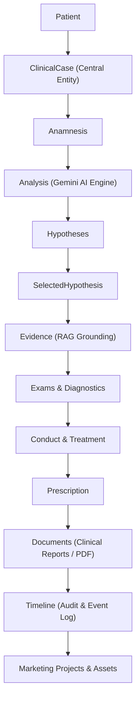

# VETMIND - MASTER CONTRACT & ENGINEERING LAWS

**Version**: 1.0.0  
**Status**: APPROVED & MANDATORY  
**Author**: Principal Software Engineer  
**Scope**: Full-Stack Architecture, Engine Specs & Governance

---

## 1. THE NON-NEGOTIABLE ENGINEERING CONSTITUTION

Vetmind is built as a **real, production-grade full-stack veterinary clinical intelligence engine**. No shortcuts, placeholders, or fake demonstrations are permitted under any circumstance.

### 1.1 Mandatory Execution Pipeline
Every single feature, interaction, and data flow MUST explicitly implement and flow through all mandatory layers:

$$\text{UI} \longrightarrow \text{State} \longrightarrow \text{Service} \longrightarrow \text{API} \longrightarrow \text{Backend Service} \longrightarrow \text{Repository} \longrightarrow \text{Firebase} \longrightarrow \text{Response} \longrightarrow \text{State} \longrightarrow \text{UI}$$

### 1.2 Prohibited Practices (Strict Violations)
The following practices are strictly banned from the codebase:
- ❌ **No Permanent Mocks**: Mock files or mock data responses in production runtime are illegal.
- ❌ **No Hardcoded Data**: Clinical values, patient metadata, and AI responses must be dynamic and stored in Firestore.
- ❌ **No `setTimeout` Latency Simulation**: Fake processing timers simulating backend work are forbidden.
- ❌ **No Empty Functions or Stubs**: Functions without real operational bodies are disallowed.
- ❌ **No `// TODO` replacing implementation**: `TODO` comments used as a substitute for executable logic are prohibited.
- ❌ **No UI Button Without Backend**: Every interactive control must trigger a verified backend endpoint/service.
- ❌ **No Endpoint Without Consumer**: Backend API endpoints without connected frontend callers are forbidden.
- ❌ **No Service Without Real Implementation**: Service classes/hooks must communicate with real repositories and backend endpoints.
- ❌ **No Firestore Without Real Integration**: Database calls must target live Firestore schemas with strict rules.

---

## 2. CENTRAL ENTITY GOVERNANCE: `ClinicalCase`

All clinical functionality in Vetmind derives exclusively from a single root entity: **`ClinicalCase`**. No isolated or duplicated clinical state is permitted outside this lineage chain.

### Lineage Integrity Rules
1. A **Patient** owns multiple **ClinicalCase** instances.
2. An **Anamnesis** cannot exist without a parent `caseId`.
3. AI **Analysis** and **Hypotheses** must trace their origin back to a specific `anamnesisId` and `caseId`.
4. **Evidence** must link selected hypotheses to indexed literature chunks in the RAG repository.
5. **Prescriptions** and **Documents** must reference a valid `caseId` and `patientId`.
6. **TimelineEvents** must record every state change of a `ClinicalCase`.
7. **MarketingProjects** derive strictly from completed or selected clinical case summaries with owner consent.

---

## 3. STACK & SECURITY SPECIFICATIONS

### 3.1 Technology Stack
- **Frontend**: React (v18+), TypeScript (v5+), Vite, TailwindCSS (Vanilla CSS tokens), Framer Motion.
- **Backend**: Firebase Authentication, Cloud Firestore, Firebase Storage, Cloud Functions (Node.js/TypeScript), Firebase App Check.
- **Artificial Intelligence**: Google Gemini (Gemini 1.5 Pro / Flash & text-embedding-004) invoked exclusively via Cloud Functions backend services.

### 3.2 Security & Key Isolation
- **API Key Zero-Exposure**: Gemini API keys, service account credentials, and secret tokens MUST NEVER be included in frontend bundles, environment variables exposed to Vite (`VITE_*`), or client state.
- **Authentication**: All Cloud Functions endpoints require a valid Firebase ID token (`Authorization: Bearer <idToken>`).
- **App Check**: Client requests must present a valid Firebase App Check token.
- **Ownership Isolation**: Every collection document must enforce `userId == request.auth.uid`. Cross-user data leaks are strictly prevented via Firestore Security Rules.

---

## 4. DESIGN SYSTEM IDENTITY

- **Font**: Inter (Google Fonts)
- **Palette**:
  - Primary / Clinical Blue: `#4F46E5`
  - Clinical Blue Dark: `#3730A3`
  - Trusted Green: `#0F8A5F`
  - Green Dark: `#08704C`
  - Background: `#F7F7F5` (with subtle premium paper texture)
  - Surface: `#FFFFFF`
  - Text Primary: `#292D3A`
  - Text Secondary: `#667085`
  - Border: `#E7E7E3`
- **Aesthetic Direction**: Premium, minimalist, clinical, editorial, human, sophisticated.
- **Forbidden Visuals**: Generic AI glowing purples, excessive neon blues, heavy dropshadows, exaggerated flashy gradients.
